# SCAVENGER'S EDGE
* 장르 : 액션 RPG
* 작업기간 : 65일 (26.01.14~26.03.20)
* 개발인원 : 1인
* 기술 스택    
    * 엔진 : Unreal Engine 5
    * 언어 : C++
    * Tool : Git, Visual Studio, PhotoShop
    * AI : Behavior Tree, AI Perception
    * UI : UMG
    * 기타 응용 패턴 : Pub-Sub, Event Bus, Object Pooling, 전략, 템플릿 메서드 패턴

## 목차
1. [프로젝트 개요](#1-프로젝트-개요)
1. [핵심 구현](#2-핵심-구현)
    1. [플레이어 액션과 콤보 연계](#플레이어-액션과-콤보-연계)
    1. [스킬 시스템](#스킬-시스템)
    1. [몬스터 AI](#몬스터-AI)
    1. [보스 몬스터](#보스-몬스터-행동)
1. [트러블슈팅](#3-트러블슈팅)
1. [기타 기능](#4-기타-기능)
    1. [스탯과 효과](#스탯과-효과)
    1. [아이템](#아이템)

 

# 1. 프로젝트 개요

'빈딕투스 : 디파인 페이트'를 레퍼런스로 제작한 3인칭 액션 RPG입니다. 
콤보를 통한 공격과 효과 부여, 성장에 통한 스킬 시스템을 중점으로 작업했습니다. 
몬스터가 유저의 액션에 반응하도록 AI를 설계했고 
보스 몬스터는 유저와의 전투를 더 동적으로 수행할 수 있게 여러 종류의 패턴을 구현했습니다.

[⏫목차로 이동](#목차)
  

# 2. 핵심 구현
## 플레이어 액션과 콤보 연계
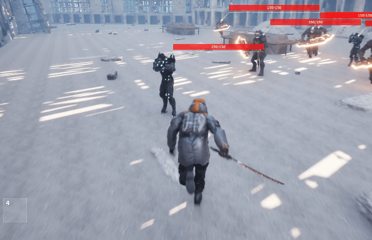

* 설계 의도 :  
   * '몬스터헌터', '빈딕투스 : 디파잉 페이트'처럼 유저가 숙련될수록 전투의 깊이와 표현이 달라지는 경험을 목표로 했습니다.
   * 이를 위해 액션 간 콤보 선택지를 유연하게 확장할 수 있는 구조가 필요했습니다.
* 구현 방식 : 
    * `DataAsset`으로 액션을 모듈화했습니다.
    * 생성한 액션 `DataAsset`을 가지고 그래프 구조로 연결하여 콤보 연계를 구현했습니다.
* 특징 : 
    * 코드 수정 없이 에디터만으로 액션 추가, 수정 가능합니다.
    * 플레이어의 액션에서 그래프 연결을 따라가며 콤보 연계가 가능합니다.
    * 액션 시작, 적중 등의 시점에 효과를 할당 가능합니다.

### [`UPlayerActionComponent`](./Source/ARPG_Hunter/Component/Action/Player/)
플레이어의 회피, 상호작용, 공격 등의 애니메이션을 처리하는 컴포넌트입니다. 
캐릭터의 여러 동작을 하나의 액션으로 모듈화하여 액션과 이어진 액션을 연계하는 기능을 구현했습니다.

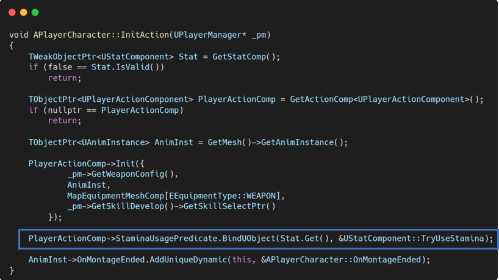

액션 실행에 필요한 스태미너 소모 로직은 `UStatComponent`에 직접적인 참조를 피하기 위해 델리게이트로 처리했습니다. 
`APlayerCharacter`에서 `UStatComponent`의 `TryUseStamina()`를 바인딩 해주었고 
액션 실행 전 델리게이트를 호출하여 사용 가능 여부를 확인하는 구조입니다.

### 콤보 연계
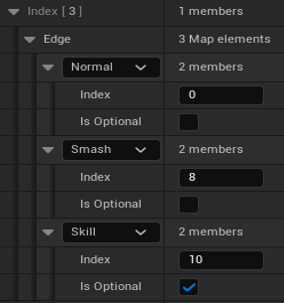
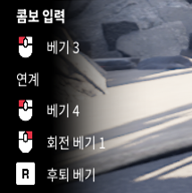

공격 액션은 3가지 유형(일반, 스매시, 스킬)이 있습니다. 
액션들 간에 사전에 설정된 연결 정보를 기반으로 연속적으로 액션을 수행합니다.

공격 액션이 실행되고 일정시간 내에 연결된 공격유형에 해당하는 입력이 들어오면 다음 공격이 실행되는 방식입니다.

### [`UAction`](./Source/ARPG_Hunter/Data/Action.h)
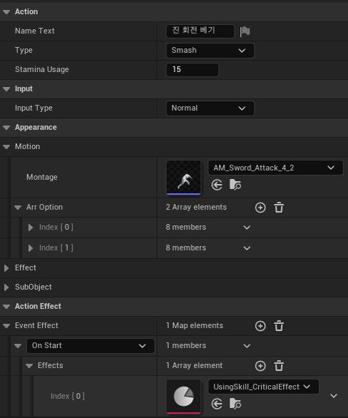

액션을 모듈화한 `DataAsset`입니다. 
액션으로 실행할 `UAnimMontage`를 기반으로 작동합니다. 
`UAnimMontage`에서 설정한 노티파이를 이용하여 액션의 세부적인 동작을 수행합니다.

공격 액션의 경우, `UAnimNotify`를 상속한 [`UAttackNotify`](./Source/ARPG_Hunter/Animation/AnimNotify/AttackNotify.cpp)를 사용합니다. 
`UAttackNotify`의 멤버변수 인덱스를 통해 원하는 시점에 수행하는 동작에 대한 데이터에 접근합니다.

`UAttackNotify`의 경우, 플레이어 뿐만 아니라 몬스터도 사용하고 있기 때문에 
특정 액터 클래스에 의존하지 않도록 `IAttackNotifyHandler` 인터페이스를 만들어 사용했습니다. 
`HandleAttackNotify()`를 구현하여 몽타주 재생 중 정확한 시점의 타격 및 세분화된 공격 동작을 수행합니다.

### 액션 실행 중 효과 발동
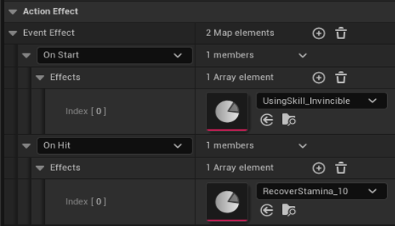

액션이 진행하는 과정에서 효과를 적용할 수 있도록 했습니다. 
`UAction`에 원하는 시점에 `UEffectData`를 할당하여 효과를 적용할 수 있습니다. 
액션에서 효과를 적용하는 시점을 설정해두고 각각의 시점에서 할당한 효과를 적용시킵니다.

### [`UActionComboData`](./Source/ARPG_Hunter/Data/ActionComboData.h)
캐릭터가 사용하는 `UAction`간의 연계에 대한 정보를 담은 데이터 에셋입니다. 
`UAction`간의 연결은 인접리스트를 이용한 그래프로 구현했습니다.

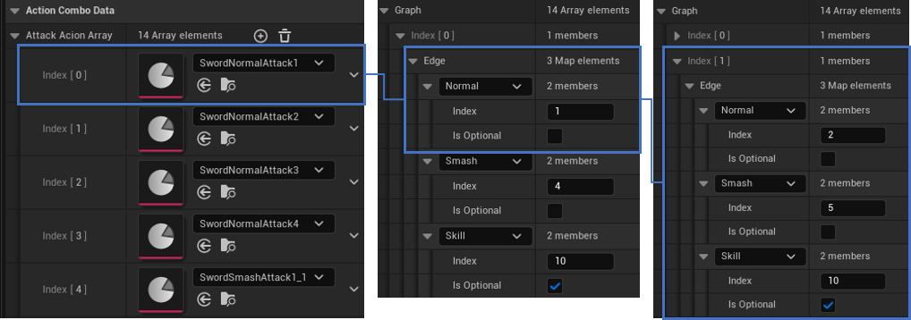

[⏫목차로 이동](#목차)
  

## 스킬 시스템
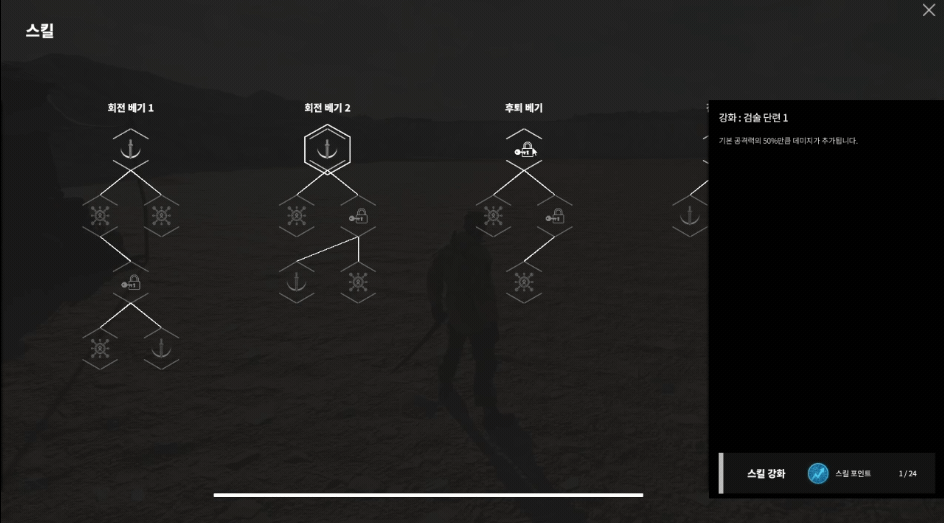

* 설계 의도 :
   * 유저가 초반엔 간단한 콤보로 조작에 익숙해지도록 하고, 성장에 따라 콤보를 확장하거나 강화시켜 성장 체감을 느끼게 하고 싶었습니다.
   * 레벨 업을 통해 스킬 포인트를 얻어서 점진적으로 더 강력하거나 편리한 스킬을 획득하도록 트리 구조로 구현했습니다.
* 구현 방식 : 
    * 액션에 영향을 주는 스킬 노드를 `DataAsset`으로 모듈화했습니다.
    * 스킬 노드를 트리 구조로 연결하여 확장성을 확보했습니다.
* 특징 : 
    * 코드 수정없이 에디터만으로 스킬트리를 구성할 수 있습니다.

### 스킬 구현
플레이어의 스킬은 본래 가진 액션의 성능을 강화하거나 새로운 액션 연계를 얻는 방향으로 구현했습니다. 
스킬 성장에 필요한 스킬 포인트는 스테이지를 클리어해서 얻은 경험치로 레벨을 올려 얻을 수 있습니다. 
스킬 포인트로 스킬트리에 따라 원하는대로 육성할 수 있도록 개발했습니다.

### [`UActionInstance`](./Source/ARPG_Hunter/Action/)
스킬의 적용은 플레이어의 선택에 따라 동적이기 때문에 `UPlayerActionComponent`에서 
`UAction`을 한 차례 감싼 `UActionInstance` 클래스를 사용하고 있습니다. 
`UAction`의 기본 설정값과 함께 스킬 성장으로 얻은 값을 추가하도록 처리했습니다.

### [`USkillUpgrade`](./Source/ARPG_Hunter/Data/SkillUpgrade.h)
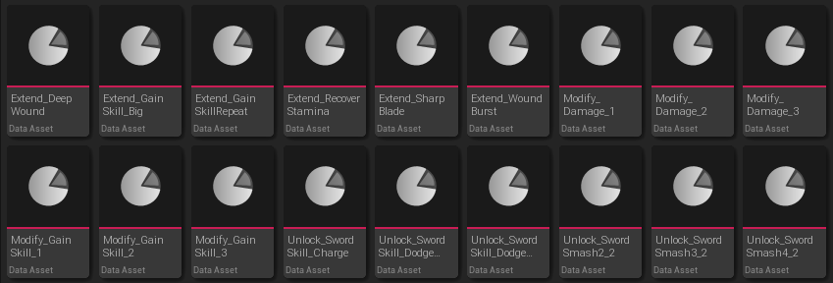

스킬 강화를 나타내는 `DataAsset`입니다. 
플레이어가 해당 강화를 선택하면 지정된 액션에 강화 내용이 반영됩니다. 
다형성을 이용하여 상위 클래스에서 `AdjustSkillNode()`를 호출하면 
하위 클래스에서 재정의한 내용을 스킬에 반영하는 식으로 구조화했습니다.

* 주요 하위 클래스
    * `USkillNodeUnlockAction` : 특정 액션의 연계를 해금
    * `USkillNodeModifyEffect` : 액션이 기존에 가진 이펙트(버프, 디버프 등)의 수치를 변경
    * `USkillNodeExtendEffect` : 액션에 새로운 이펙트를 추가하는 기능
    * `USkillNodeModifySpec` : 액션의 데미지량, 스태미너 소모량 등을 변경

### [`USkillTreeData`](./Source/ARPG_Hunter/Data/SkillTreeData.h)
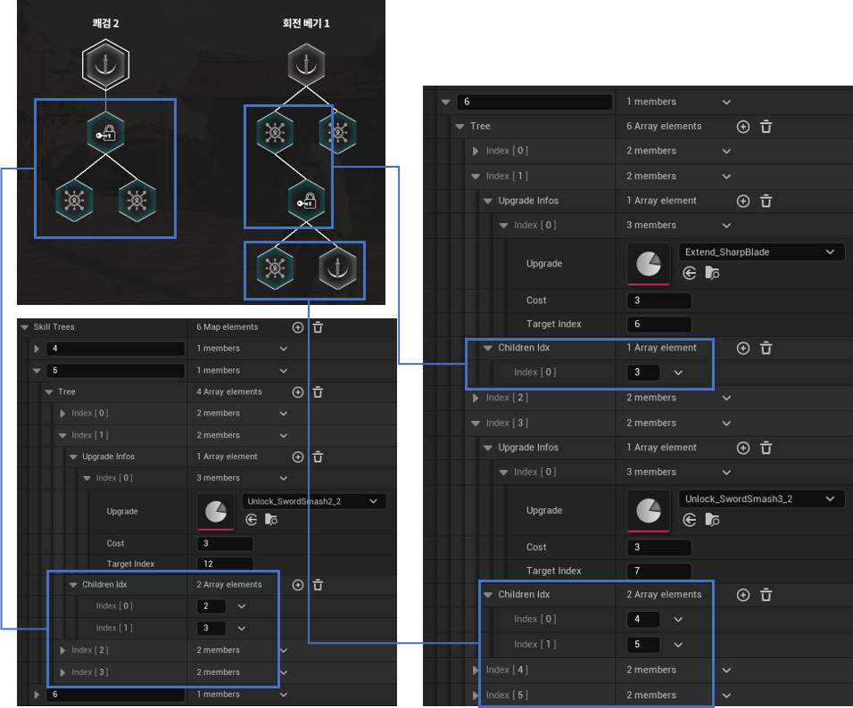

플레이어가 선택할 수 있는 스킬들을 트리 형태로 설정한 `DataAsset`입니다. 
강화할 액션의 내용, 스킬 포인트 소모량, 강화 내용으로 노드를 구성하고 
연결될 자식 노드들의 인덱스를 설정하여 트리 형태가 되도록 설정했습니다.

[⏫목차로 이동](#목차)
  

## 몬스터 AI

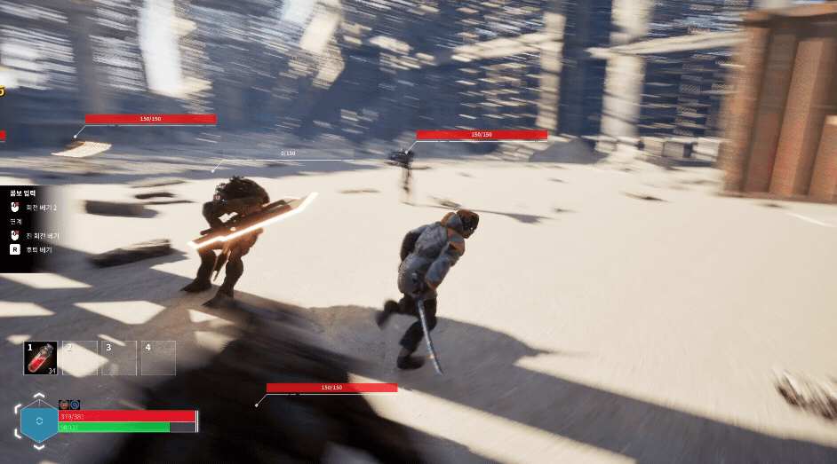

* 설계 의도 :
    * 몬스터가 현재 경계 상태를 기반으로 행동하고, 전투 시 플레이어의 액션에 반응하여 행동하도록 하고 싶었습니다.
* 구현 방식 :
    * `AIPerception`를 이용하여 기본 경계 상태를 변경시키고, 경계 상태에 따라 `BehaviorTree`로 행동 패턴을 구현했습니다.
    * 플레이어의 액션을 감지하기 위해서 `AIPerception`의 `UAISense` 클래스를 상속하여 확장했습니다.
* 특징 : 
    * 몬스터가 주변을 시각적으로 인식하여 플레이어를 감지합니다.
    * 몬스터가 일반 상태에서 플레이어에게 공격받으면 주변 몬스터에게 신호를 보내 전투에 참여합니다.
    * 몬스터가 플레이어의 액션을 감지하여 반응할 수 있습니다.

### 몬스터 구조
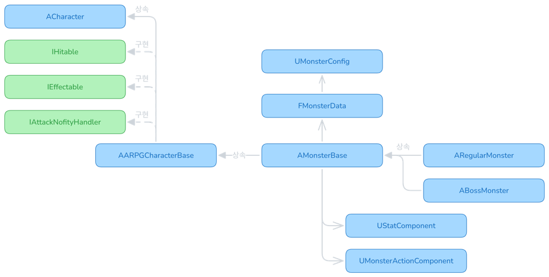

* 상속 및 구현 
플레이어와 같이 [`AARPGCharacterBase`](./Source/ARPG_Hunter/Character/)를 상속하고 있습니다. 
`AARPGCharacterBase`는 `ACharacter`, `IEffectable`, `IHitable`, `IAttackNotifyHander`를 상속하고 구현하고 있습니다.

* [`UStatComponent`](./Source/ARPG_Hunter/Component/Stat/) 
플레이어와 동일하게 스탯 기능과 이펙트를 반영할 수 있도록 했습니다.

* [`MonsterActionComponent`](./Source/ARPG_Hunter/Component/Action/Monster/) 
몬스터의 경우, 플레이어와 다르게 콤보 연계의 기능이 필요 없으므로 간략한 형태로 구현했습니다. 
BT를 통해서 입력된 공격 액션을 수행합니다.

* [`MonsterConfig`](./Source/ARPG_Hunter/Data/MonsterConfig.h), [`MonsterData`](./Source/ARPG_Hunter/Data/MonsterData.h) 
몬스터의 경우, 외형, 액션은 데이터에셋으로, 스탯은 데이터테이블을 통해서 구성하도록 구조화했습니다. 
몬스터 데이터테이블의 ID를 가지고 던전 스테이지에 사용할 몬스터들을 구성할 수 있도록 했습니다.

### `AIPerception` 사용 이유
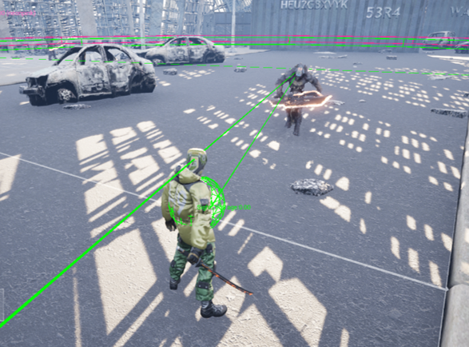

`AIPerception`은 몬스터가 주변환경을 시각, 청각 등 다양한 자극을 이용해 인식하는 로직을 제공하고 있으며, 
데미지를 받았을 때 주변 팀원에게 전파하는 이벤트 기반 시스템을 내장하고 있습니다.

다양한 종류의 자극이 발생하는 환경에서 안정성과 최적화된 성능을 확보할 수 있고, 
`UAISense` 클래스를 상속하여 자체 제작한 자극을 몬스터가 인식하도록 확장할 수 있어 `AIPerception`를 활용했습니다.

### `AIPerception`과 `BehaviorTree` 활용
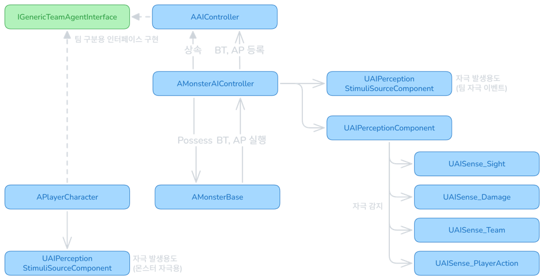

`AIPerception`를 통해 플레이어를 인식한 몬스터가 경계하고 전투를 벌이는 행동 양식을 `BehaviorTree`로 구현했습니다.

몬스터는 일반, 의심, 경계, 교전으로 이루어진 경계 상태를 가지며 
`AIPerception`를 통해 몬스터는 플레이어를 감지하고 경계 상태를 변경합니다. 
`BehaviorTree`에 각 경계 상태에 대한 행동 양식을 설정해주었습니다.

### 커스텀 [`UAISense`](./Source/ARPG_Hunter/AI/Sense/)
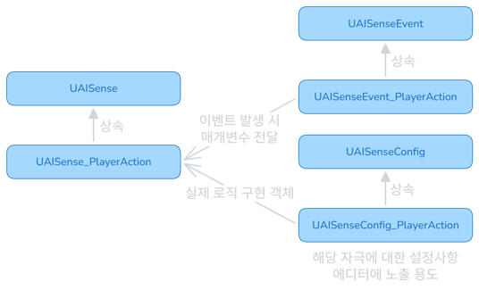

교전 중 몬스터가 플레이어의 공격, 아이템 사용을 감지할 수 있도록 
`UAISense`를 상속하여 [`UAISense_PlayerAction`](./Source/ARPG_Hunter/AI/Sense/)을 만들었습니다.

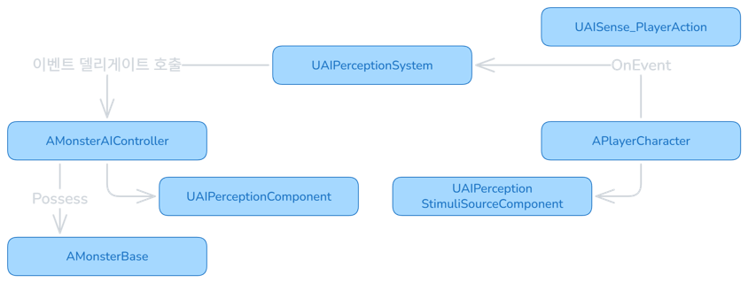

일반 몬스터는 플레이어의 공격을 감지하면 확률적으로 회피 모션을 수행합니다. 
보스 몬스터는 플레이어의 아이템 사용을 감지하면 확률적으로 원거리 견제 패턴을 수행합니다.

몬스터가 플레이어의 행동에 반응하여 보다 역동적으로 전투를 진행할 수 있도록 구현했습니다.

[⏫목차로 이동](#목차)
  

## 보스 몬스터 행동

* 설계 의도 : 
    * 보스가 유저의 행동이나 위치 등의 요소에 영향을 받아 전투를 하도록 구현하려 했습니다.
* 구현 방식 : 
    * 유저와 보스의 위치를 기반으로 공격 패턴을 선택하도록 했습니다.
    * `AIPerception`을 이용한 유저 아이템 사용을 감지하고 견제 패턴을 수행합니다.
    * 공격 패턴을 실행하고 일정 주기마다 강력한 기믹 패턴 수행하도록 작업했습니다.
* 특징 : 
    * 유저의 행동에 반응하여 견제 패턴 수행이 가능합니다.
    * `UAction`을 사용하여 패턴을 조립하듯 설정할 수 있습니다.

### 전투 패턴
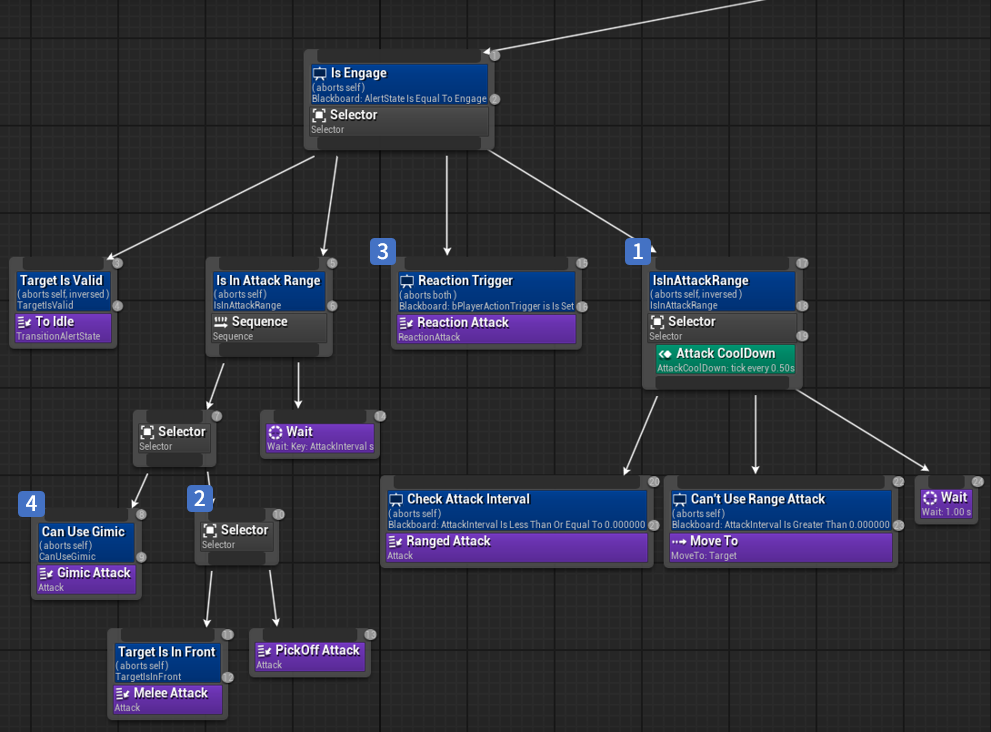

1. 플레이어의 거리 확인 
플레이어와 거리가 멀 땐, 플레이어를 추적하며 원거리 공격 또는 돌진 공격을 수행합니다. 
플레이어에게 거리를 좁힘과 동시에 견제 액션을 취하도록 작업했습니다.

2. 근접 공격 패턴 및 위치에 따른 견제 패턴 
플레이어와 거리가 가까워지면 근접 공격 패턴 수행합니다. 
이때, 플레이어가 보스의 정면에 있다면 일반적인 근접 공격을 실행합니다.  
하지만 플레이어는 대체로 보스 정면보단 측면이나 후면에서 위치를 잡을 것을 고려하여 
플레이어가 보스의 측면, 후면에 위치한 경우 각 방향에 따라 견제 패턴을 수행하며  
플레이어를 향하도록 했습니다.

3. 플레이어 아이템 사용 감지 견제 패턴 
플레이어는 전투 중 체력이 떨어지면 보스와 거리를 벌려 아이템을 사용하려 할 것입니다. 
보스는 `UAISense_PlayerAction` 을 통해 플레이어의 아이템 사용을 감지하고 
이를 방해하기 위해 원거리 공격으로 견제하도록 `BehaviorTree`를 구현했습니다.

4. 기믹 패턴 
보스는 공격 패턴마다 스킬 포인트를 얻고 
스킬 포인트가 10이상 모이면 기믹 패턴을 수행합니다.

### 기믹 수행
보스 몬스터는 기믹을 수행할 수 있도록 구현했습니다. 
공격 몽타주에 `GimicNotify`를 설정하여 특정한 종류의 기믹을 수행할 수 있습니다. 
각 기믹 액션을 파훼하면 보스 몬스터는 일시적으로 그로기 상태가 됩니다.

#### 기믹 액션 종류
* 카운터 :  
 
보스가 정면으로 이동하며 공격합니다.  
보스 정면 (정면 90도 이내 방향)에서 스매시, 스킬 공격 시 파훼 가능합니다.

* 무력화 :  
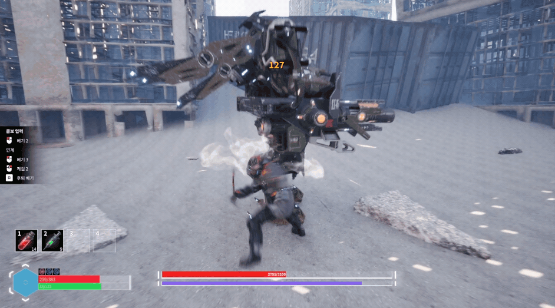 
보스가 일정 시간 동안 무력화 가능 상태가 됩니다.  
무력화 게이지를 0으로 만들지 못하면 일정 시간 후 매우 강력한 공격을 실행합니다.

[⏫목차로 이동](#목차)
  

# 3. 트러블슈팅
## 레벨 시퀀스 적용 후 빌드 에러
### 문제 발생과 원인
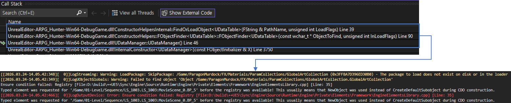

보스 몬스터의 등장 연출을 위해 레벨 시퀀스를 이용한 컷씬 작업 후 에러를 발견했습니다. 
에디터를 통한 테스트 이후, 빌드 테스트를 진행하다 에러을 확인했습니다.

에러 로그를 살펴보니 `DataManager` 초기화 중 스테이지 데이터테이블을 참조하는 과정에서 문제가 발생했습니다. 
스테이지 데이터테이블에서 레벨 시퀀스를 참조하고 있고 레벨 시퀀스에서 사용하는 특정 액터가 아직 등록되지 않아 문제가 발생했습니다.

### 해결방법
등록되지 않았다는 로그를 보고 빌드 시 에셋 누락이 발생했다고 생각했습니다. 
프로젝트 세팅에서 패키징 시, 특정 에셋을 반드시 포함하도록 설정하고 다시 빌드를 시도했습니다. 
그럼에도 빌드는 실패했고 동일한 에러 로그가 출력됐습니다.

에셋 누락이 아니라면 데이터테이블에서 레벨 시퀀스를 직접 참조하기 때문에 발생한 것이라 판단했고 
검증을 위해서  데이터테이블에서 레벨 시퀀스를 `TObjectPtr`이 아닌 `TSoftObjectPtr`로 변경했습니다. (하드 레퍼런스 -> 소프트 레퍼런스로 변경) 
그 후 다시 빌드 시도에서 성공한 것을 확인했습니다.

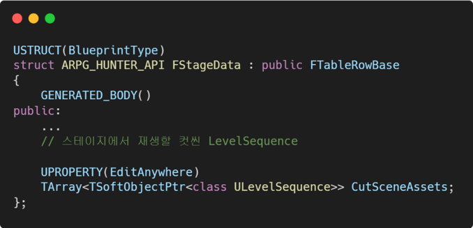
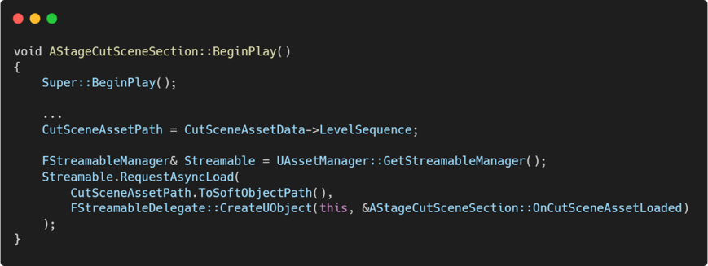

레벨 시퀀스를 사용하는 부분에서 레벨 시퀀스 에셋을 비동기 로드하도록 변경 후 사용하는 것으로 문제를 해결했습니다.

[⏫목차로 이동](#목차)
  

# 4. 기타 기능
## 스탯과 효과
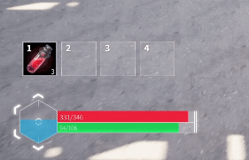
* 설계 의도 : 
스킬, 액션, 아이템 사용 등을 통한 버프, 디버프 효과 부여하여 전투를 보조하는 기능을 구현하려 했습니다. 
이를 위해선 재사용성과 확장성 있는 효과 적용 구조가 필요했습니다.
* 구현 방식 : 
    * 스탯 컴포넌트 구현하여 효과를 반영할 기반을 만들었습니다.
    * 아이템, 스킬 액션에서 효과 적용을 위해 Data Asset을 활용했습니다.
* 특징 : 
    * 코드 수정 없이 에디터를 통해 새로운 효과 생성 및 수정이 가능합니다. 
    * 생성한 효과 `DataAsset`을 아이템, 액션에 할당하여 조립하듯 구성할 수 있습니다.

### [`UStatComponent`](./Source/ARPG_Hunter/Component/Stat/)
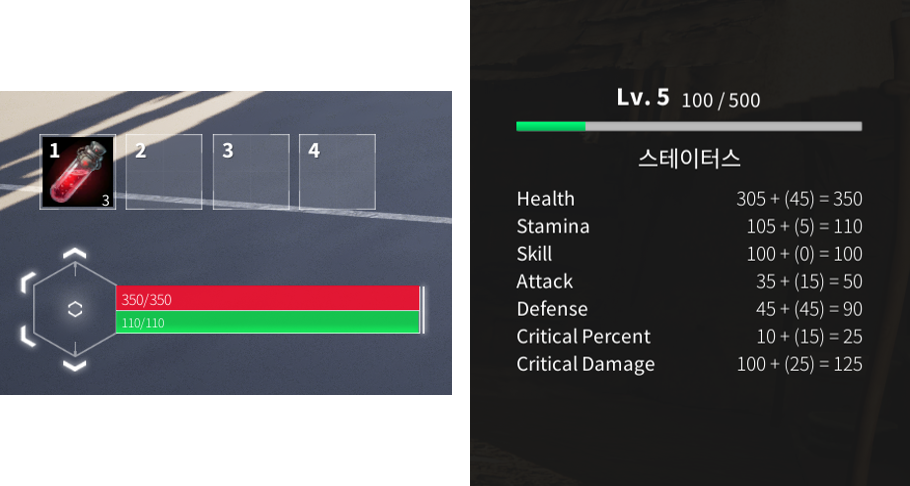

캐릭터의 체력, 스태미너, 공격력 같은 스탯을 관리하는 액터 컴포넌트입니다. 
캐릭터가 가진 기본 스탯뿐만 아니라 장비와 효과로 얻은 스탯도 반영할 수 있습니다.
체력, 스태미너, 스킬 게이지는 자원 요소로 처리합니다. 자원 요소들은 값 변동과 고갈 시, 이벤트를 발행하여 UI 연동하는 등의 용도로 사용했습니다.

자원 중에서 스태미너와 스킬 게이지는 캐릭터의 액션과 함께 사용됩니다. 
모든 액션은 스태미너를 소모하여 작동하고 스태미너는 액션 중이지 않다면 천천히 회복됩니다. 
액션 중 스태미너가 0이 되면 5초간 천천히 걸으며 스태미너가 회복되지 않는 페널티 기능을 구현했습니다.

스킬 게이지는 전투 중 획득 가능하고 스킬 게이지를 소모하여 액션에 부여된 효과를 발동합니다.

### [`UEffect`](./Source/ARPG_Hunter/Effect/)
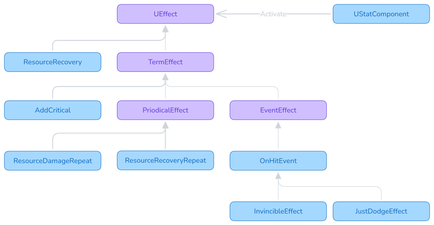

버프, 디버프를 적용하는 효과 클래스입니다. 
효과 기능들이 스탯에 영향을 준다는 공통점에 착안하여 
`UStatComponent`에서 모든 효과를 등록, 해제하고 관리하도록 구현했습니다.

`UStatComponent`를 외부에서 직접 접근하는 과정에서 특정 액터에 대한 의존성이 발생하지 않도록 
`IEffectHandler` 인터페이스를 만들어 `ApplyEffect()`를 구현하도록 했습니다.

새로운 효과를 추가하기 쉽도록 다형성을 활용했습니다. 
상위 클래스의 `Activate()`를 호출하면 하위 클래스에서 재정의한 구체적인 효과가 실행되도록 구조를 잡았습니다.

* 주요 클래스
    * `UTermEffect` : 일정 기간 동안 유지되어 효과를 부여 (예, 10초 동안 적용)
    * `UPeriodicalEffect` : 일정 기간 동안, 특정 주기마다 효과를 부여 (예, 10초 동안 1초마다 적용)
    * `UEventEffect` : 액터에게 특정 이벤트가 발생할 때 효과를 부여 (예, 피격 시 발동)
    
### [`UEffectData`](./Source/ARPG_Hunter/Data/EffectData.h)
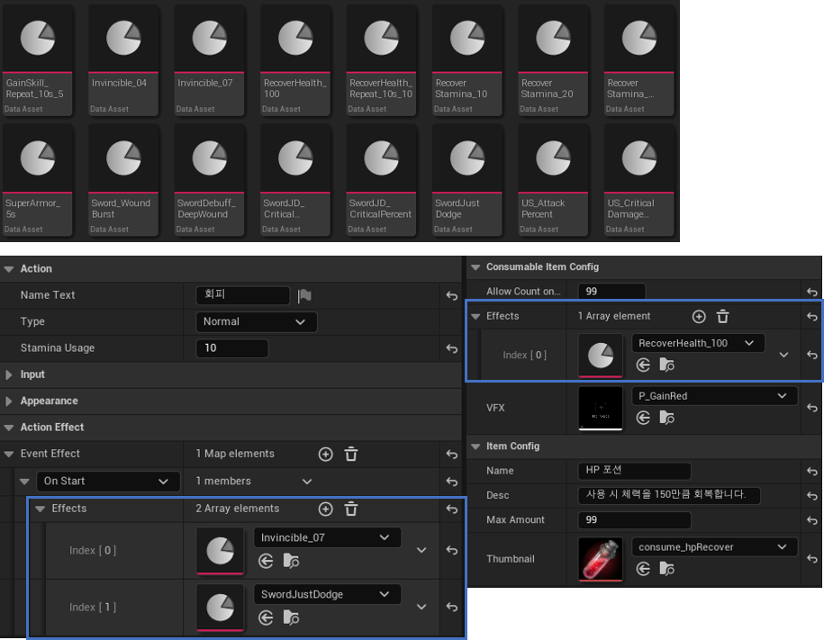

효과 값을 설정해두기 위한 데이터 에셋입니다. 
설정해둔 데이터 에셋을 액션 에셋이나 아이템에 할당할 수 있습니다.

동일한 유형의 효과를 데이터 에셋으로 모듈화하고 여러 액션에서 재사용하여 
캐릭터 무기의 컨셉에 맞게 조립하듯 사용할 수 있습니다.

[⏫목차로 이동](#목차)
  

## 아이템
### 아이템 구조
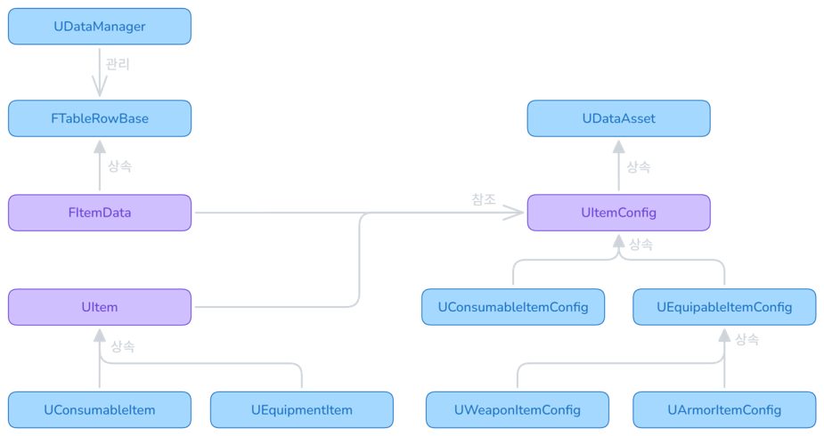

* 설계 의도 : 
    * 장비 제작과 강화, 소비형 아이템을 사용하여 효과를 얻기 위한 아이템 기능이 필요했습니다.
    * 스테이지를 클리어하여 일반 아이템을 얻고, 일반 아이템을 사용하여 장비를 제작 또는 강화하는데 사용합니다.
    * NPC를 통해 회복약과 같은 소비 아이템을 구매하도록 합니다.
* 구현 방식 : 
    * 유저가 사용하는 아이템의 종류는 3가지(일반, 소비, 장비)로 나눴습니다.
    * 데이터 테이블을 만들어 아이템 정보를 관리하고, 세부적인 사용 효과, 장비 스펙과 같은 요소는 각 종류별 `DataAsset`을 만들어 기입했습니다.

 

* 일반 아이템 : 재료로 사용하여 아이템 제작에 사용합니다.
* 소비 아이템 : 아이템을 소비하여 플레이어에게 각종 효과(버프, 디버프)를 제공합니다.
* 장비 아이템 : 장착 시, 플레이어의 스탯을 상승시킵니다.

### 아이템 데이터
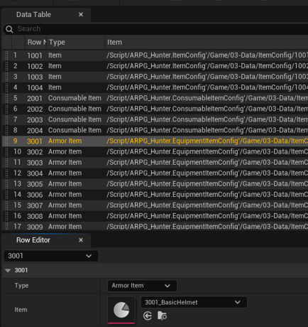

데이터테이블과 `DataAsset`을 사용하여 다양하고 많은 아이템의 데이터를 추가하기 쉽게 작업했습니다.

데이터테이블을 사용해서 대량의 아이템 데이터를 관리하고 
종류마다 세부적인 정보는 `DataAsset`으로 모듈화하는 방향으로 작업했습니다.

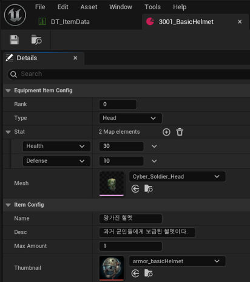
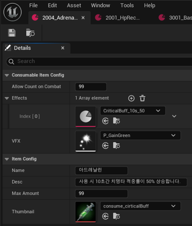
